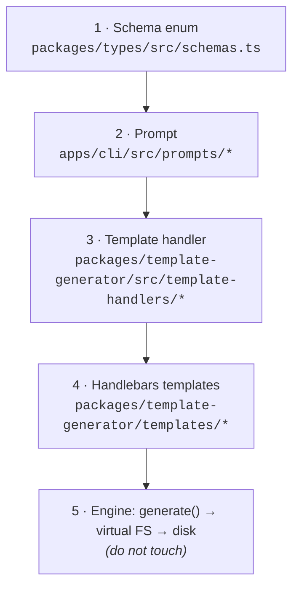

# Understanding `create-better-t-stack` - Architecture & Extension Model

> A precise reference for extending this project with new stack options (e.g. a Python / uv / ML ecosystem).
>
> **This repo:** `SCIAM-FR/create-better-s-stack` - a fork of upstream `AmanVarshney01/create-better-t-stack`, currently at parity with upstream release **`v3.30.3`** (only `MIGRATION/` is untracked; no code divergence yet). License: MIT.
> **Package names:** root workspace `better-t-stack`; the published CLI is still **`create-better-t-stack`** (`apps/cli`), with **`create-bts`** as a thin alias.
> File/line references below are to this repository's source as the ground truth - verify them after a `git pull` or rebase on upstream.

---

## 1. What this project actually is

`create-better-t-stack` is **not** a collection of starter templates. It is a **schema-driven scaffolding engine**:

1. A user's choices are validated against a set of typed Zod enums.
2. They are normalized into a single **Project Configuration** object.
3. That object deterministically drives which template folders get rendered and written to disk.

Internalizing this is the key to extending it: _you almost never write imperative "if the user picked X, copy these files" glue by hand - you declare an option in a schema, register a prompt for it, and map its value to a folder of templates._ The engine does the rest.

The published npm CLI (`apps/cli`) is only one app inside a larger monorepo.

---

## 2. Monorepo layout

A **Bun workspaces + Turborepo** monorepo.

| Path                          | Role                                                                                                                                                                       | Touch when extending?                                         |
| ----------------------------- | -------------------------------------------------------------------------------------------------------------------------------------------------------------------------- | ------------------------------------------------------------- |
| `apps/cli`                    | The published interactive CLI (`create-better-t-stack`): prompts, orchestration, the `create` and `add` flows, install / post-install. Source in `src/`, tests in `test/`. | **Yes** - prompts, defaults, compatibility map, install logic |
| `apps/web`                    | Next.js docs site **and** the visual "Stack Builder" at better-t-stack.dev. Consumes the shared schema/JSON-Schema.                                                        | **Yes** - keep in sync                                        |
| `packages/types`              | **The single source of truth.** Zod schemas, inferred TS types, and JSON-Schema converters.                                                                                | **Yes** - primary lever                                       |
| `packages/template-generator` | The generation engine + **all Handlebars (`.hbs`) templates** + the `dependencyVersionMap`.                                                                                | **Yes** - handlers + templates                                |
| `packages/create-bts`         | A thin published **alias** package (`create-bts`) that simply depends on `create-better-t-stack`. No logic.                                                                | No                                                            |
| `packages/backend`            | A Convex backend powering the **website** (analytics etc.). Not part of generated projects.                                                                                | No                                                            |

Two root files exist specifically to convey intent to humans and agents: **`CONTEXT.md`** (domain language + testing philosophy) and **`AGENTS.md`** (contribution conventions, template-authoring rules). They are authoritative - read them first.

---

## 3. The core domain model

Per `CONTEXT.md`, a generated project is a **Project Configuration** composed of:

- **One Core Stack** - the mutually-constrained primary choices that define the project's shape: `frontend` (an **array** - web + native), `backend`, `runtime`, `database`, `orm`, `api`, `auth`, `payments`, `dbSetup`, `webDeploy`, `serverDeploy`, `packageManager`, `git`, `install`.
- **Zero or more Addons** - optional capability layers that don't change the stack's identity (PWA, Tauri/Electrobun desktop wrappers, linters, monorepo tooling, docs, MCP, skills…).
- **Zero or more Examples** - generated sample features demonstrating the stack (currently `todo`, `ai`).

The single most important extension decision is this classification: **is the thing you're adding a Core Stack choice (constrained, part of the exhaustive test matrix) or an Addon/Example (composable, tested by representative combos)?** Core-Stack additions multiply the exhaustive matrix; Addon/Example additions don't.

> Canonical config shapes live in `packages/types/src/schemas.ts`: `ProjectConfigSchema` (in-memory config) and `BetterTStackConfigFileSchema` (the persisted `bts.jsonc`, published as a JSON Schema at `https://r2.better-t-stack.dev/schema.json`).

---

## 4. How a choice becomes files: the five-layer pipeline

Every option - `hono`, `drizzle`, `tauri`, anything - flows through the same five layers. To add an option you edit layers 1–4; layer 5 is the engine and you never touch it.



### Layer 1 - Schema (`packages/types/`)

**`src/schemas.ts`** - every valid value is a Zod enum. For example:

```ts
export const BackendSchema = z
  .enum(["hono", "express", "fastify", "elysia", "convex", "self", "none"])
  .describe("Backend framework");

export const RuntimeSchema = z
  .enum(["bun", "node", "workers", "none"]) // `none` is the short-circuit sentinel (convex/self/none backends)
  .describe("Runtime environment");
```

This file also defines the composite shapes (`CreateInputSchema`, `AddInputSchema`, `ProjectConfigSchema`, `BetterTStackConfigSchema`) and exports `*_VALUES` arrays (e.g. `BACKEND_VALUES = BackendSchema.options`) for iteration.

**Cross-field validation at the schema layer is deliberately minimal** - only:

- `AddonsListSchema.superRefine` → `nx` and `turborepo` cannot coexist.
- `CreateInputSchema.refine` → `manualDb` and `dbSetupOptions.mode` are mutually exclusive.
- `ProjectNameSchema.refine` chain → name format rules (no leading dot/dash, reserved names, invalid chars).

> The **bulk** of compatibility logic does **not** live in the schema. It lives in (a) prompt narrowing (Layer 2), (b) the runtime validator `apps/cli/src/validation.ts` (`validateConfigCompatibility`, used on the `--yes` path), and (c) the test-owned **Compatibility Oracle** (§6). Don't expect to encode rich constraints purely in Zod.

Sibling files in `packages/types/src/`:

- **`types.ts`** - TS types inferred from the schemas (`type Backend = z.infer<typeof BackendSchema>`, etc.).
- **`json-schema.ts`** - per-schema `z.toJSONSchema()` converter functions plus `getAllJsonSchemas()`; consumed by the **web Stack Builder** and the **MCP Surface**.
- **`constants.ts`** - _only_ `desktopWebFrontends` (the frontends that support the Tauri/Electrobun desktop wrappers). ⚠️ **It does NOT hold `DEFAULT_CONFIG`** - see Layer 2.

### Layer 2 - Prompt (`apps/cli/src/prompts/`)

One prompt module per dimension (`backend.ts`, `runtime.ts`, `database.ts`, …), each returning `{ value, label, hint }` option lists. Three behaviours matter:

1. **A pre-supplied CLI flag short-circuits the prompt.** E.g. `runtime.ts`: `if (runtime !== undefined) return runtime;`.

2. **Prompts narrow based on earlier answers.** `runtime.ts`:

   ```ts
   export async function getRuntimeChoice(runtime?: Runtime, backend?: Backend) {
     if (backend === "convex" || backend === "none" || backend === "self") return "none"; // no question asked
     // else offer bun / node, plus "workers" only when backend === "hono"
   }
   ```

3. **Orchestration is a results-threading dependency chain.** `prompts/config-prompts.ts → gatherConfig()` runs every prompt through `navigableGroup`, threading both prior `results` and CLI `flags` into each subsequent prompt. The fixed order is:

   ```
   frontend → backend → runtime → database → orm → api → auth →
   payments → addons → examples → dbSetup → webDeploy → serverDeploy →
   git → packageManager → install
   ```

   Two distinct non-interactive paths bypass this chain (`command-handlers.ts`):
   - **`--yes`** skips `gatherConfig` entirely, composing the config as `{ ...getDefaultConfig(), ...flagConfig }` and then running `validateConfigCompatibility`.
   - The **silent context** (`isSilent()`, set via `{ silent: true }` for programmatic/API invocations) makes `gatherConfig` itself return the same defaults-merged-with-flags without prompting.

   This ordered chain is **the seam** for adding a top-level discriminator (see §8).

**Defaults & compatibility live in the CLI, not in `packages/types`:**

- `apps/cli/src/constants.ts` defines `DEFAULT_CONFIG` / `DEFAULT_CONFIG_BASE` (the `--yes` baseline: `tanstack-router` + `hono` + `bun` + `sqlite` + `drizzle` + `trpc` + `better-auth` + `turborepo`).
- The same file defines **`ADDON_COMPATIBILITY`** - a map from each addon to the frontends it supports (`[]` means no frontend constraint; `pwa → [tanstack-router, react-router, solid, next]`; `tauri`/`electrobun → desktopWebFrontends`).
- Per-option labels/hints live inline in each prompt module.

### Layer 3 - Template handler (`packages/template-generator/src/template-handlers/`)

The router that maps a chosen value to template folders and copies them into the in-memory output tree, via:

```ts
processTemplatesFromPrefix(vfs, templates, "<source-prefix>", "<dest-path>", config);
```

There is one handler per concern (`base`, `frontend`, `backend`, `database`, `api`, `packages`, `auth`, `payments`, `addons`, `examples`, `extras`, `deploy`), all re-exported from `index.ts`.

**The backend handler (`backend.ts`) is the model to copy when adding a non-TS ecosystem.** Its full logic:

```ts
if (config.backend === "none") return; // nothing
if (config.backend === "convex") {
  // redirect to a DIFFERENT tree
  processTemplatesFromPrefix(
    vfs,
    templates,
    "backend/convex/packages/backend",
    "packages/backend",
    config,
  );
  return;
}
if (config.backend === "self") return; // user brings their own backend → no files
// TS frameworks (hono | express | fastify | elysia): TWO prefixes, both → apps/server
processTemplatesFromPrefix(vfs, templates, "backend/server/base", "apps/server", config);
processTemplatesFromPrefix(
  vfs,
  templates,
  `backend/server/${config.backend}`,
  "apps/server",
  config,
);
```

Key takeaways: a TS backend always gets a shared `backend/server/base` (the `package.json` / `tsconfig.json` scaffolding) **plus** its framework folder. `convex` is **special-cased** to skip that base and point at an entirely separate tree (`backend/convex/...` → `packages/backend`); `self` and `none` **emit no server files at all**. _This early-return special-casing is precisely the escape hatch a non-TS ecosystem reuses._

### Layer 4 - Handlebars templates (`packages/template-generator/templates/`)

The actual files, suffixed `.hbs`. Top-level template trees:

```
addons/  api/  auth/  backend/  base/  db/  db-setup/  examples/  extras/  frontend/  packages/  payments/
```

The full `config` object is in scope, so any file can branch on any choice. Custom Handlebars helpers are registered in `src/core/template-processor.ts`: **`eq`, `ne`, `and`, `or`, `includes`**.

```hbs
{{#if (eq orm "prisma")}} … {{else if (eq orm "drizzle")}} … {{/if}}
```

Conventions (`AGENTS.md`):

- Files needing no templating keep a literal name; `_gitignore` is renamed to `.gitignore` by the engine.
- To emit literal `{{ … }}` (Vue/JSX), escape the opening braces as `\{{` so Handlebars doesn't evaluate them (e.g. `templates/frontend/nuxt/app/pages/index.vue.hbs`).
- Backends share the `backend/server/` tree (`base`, `hono`, `express`, `fastify`, `elysia`) rather than one self-contained folder per framework.

### Layer 5 - The engine (do not touch)

`packages/template-generator/src/generator.ts → generate(options)` builds the entire project tree in memory (**"Virtual Generation"** via `VirtualFileSystem`), then it is written out (**"Filesystem Scaffolding"**). It returns a typed `Result<VirtualFileTree, GeneratorError>` (the repo uses `better-result`, not `try/catch`, for recoverable flows).

`generate()` invokes the handlers in a **fixed sequence** (distinct from the prompt order):

```
base → frontend → backend → db → api → config/env/ui packages →
auth → payments → addons → examples → extras → deploy
```

…followed by post-processors that mutate the VFS: `processPackageConfigs`, `processDependencies`, `processEnvVariables`, `processAuthPlugins`, `processAlchemyPlugins`, `processPwaPlugins`, `processCatalogs`, `processReadme`, and finally `writeBtsConfigToVfs` (the `bts.jsonc` provenance file).

Because generation is virtual, a config can be dry-run and tested across thousands of combinations without touching disk. The processor is **language-agnostic** - it copies files and runs Handlebars with no opinion about whether the output is TypeScript or Python.

---

## 5. Post-generation: install, next steps, and the `add` flow

Helpers under `apps/cli/src/helpers/core/`:

- **`install-dependencies.ts`** - shells out via `execa` to `${packageManager} install` (`npm` / `pnpm` / `bun`). Skipped when external commands are disabled.
- **`post-installation.ts`** - prints the "next steps" guide, deriving run commands from the package manager (`pnpm run` / `bun run` / `npm run`).
- **`add-handler.ts` + `command-handlers.ts`** - implement the **Add Path** (adding addons/deploy to an existing project), which reads the persisted `bts.jsonc` via `detect-project-config.ts`.

**Both install and post-install are TypeScript/JS-package-manager-centric today** and are a required branch point for any non-JS ecosystem (e.g. `uv sync`, `uv run`).

---

## 6. Testing philosophy

`CONTEXT.md` defines tiered testing (framework: `bun:test`), and the tiers map to real files under `apps/cli/test/`:

- **Default Suite** - fast unit/integration/regression tests run locally (`*.test.ts` in `apps/cli/test/`).
- **Matrix Smoke** vs **Full Matrix Job** - both implemented in `apps/cli/test/matrix/create-matrix.test.ts`. `getMatrixMode()` switches between `smoke` (`createSmokeMatrixCases`) and `full` (`generateMatrixCases` over **every normalized Core-Stack combination**, the Exhaustive Matrix). The full job is **sharded** (`getMatrixShardFromArgs`, `MatrixShard`) and tuned via `BTS_MATRIX_*` env vars (e.g. `BTS_MATRIX_TIMEOUT_MS`, `BTS_MATRIX_MAX_TESTS_PER_SHARD`).
- **Compatibility Oracle** - a **test-owned** model in `apps/cli/test/matrix/oracle.ts` (`classifyMatrixError`, `formatMatrixConfig`) predicting which configs _should_ be accepted vs rejected. Note: it lives in test code, separate from the runtime `validation.ts`.
- **Curated Build Set** - `apps/cli/test/generated-builds.test.ts` installs/typechecks/builds a small representative set of generated projects (proven without `dry-run.test.ts`'s virtual-only checks).
- **Addon Compatibility Coverage** - representative combos + interaction rules (`addons.test.ts`, `addon-options.test.ts`, `addon-setup-regressions.test.ts`), deliberately **not** crossed through the exhaustive matrix.
- The **Create Path** owns exhaustive matrix coverage; the **Add Path** (`add-handler.test.ts`) and **MCP Surface** (`mcp.test.ts`) get focused contract coverage instead of matrix participation.

Tooling: `bun run check` (`oxfmt` + `oxlint`); Conventional Commits with scope (`feat(cli): …`, `fix(web): …`).

The practical lesson: **prefer the Addon/Example shape whenever a feature is genuinely composable** - it keeps the exhaustive matrix from exploding.

---

## 7. The five touch points, summarized

To add **any** new option:

1. **Schema** (`packages/types/src/schemas.ts`) - add the enum value; encode any hard constraint in `superRefine`/`refine`; the `*_VALUES` export updates automatically.
2. **Prompt** (`apps/cli/src/prompts/<dimension>.ts`) - add the option + label/hint; wire narrowing and order/threading in `config-prompts.ts`; update `DEFAULT_CONFIG` / `ADDON_COMPATIBILITY` in `apps/cli/src/constants.ts` if relevant.
3. **Handler** (`packages/template-generator/src/template-handlers/<dimension>.ts`) - branch on the value, pointing at template folders; register it in `generator.ts` if it's a new concern.
4. **Templates** (`packages/template-generator/templates/`) - author the `.hbs` files.
5. **Keep in sync** - the **web Stack Builder** and **MCP Surface** both read the schema/JSON-Schema; the **Compatibility Oracle** and matrix tests must cover the new combos.

---

## 8. The design tension for a non-TypeScript ecosystem

The "T" in Better-T-Stack is **end-to-end TypeScript type safety**: the frontend imports the backend's tRPC/oRPC types directly, so a server change becomes a client compile error. A Python backend **cannot participate** in that shared type graph. Several TS assumptions are baked in:

- `RuntimeSchema` = `bun | node | workers | none`; `PackageManagerSchema` = `npm | pnpm | bun`.
- The backend handler lays down the TS `backend/server/base` (package.json/tsconfig) for every framework value except the special-cased `convex` / `self` / `none`.
- `api` (`trpc` / `orpc`) and the ORMs (`drizzle` / `prisma` / `mongoose`) are TS-only.
- Monorepo addons (`turborepo` / `nx`) assume JS workspaces.
- Install and post-install shell out to JS package managers.

So the architectural question for a fork is **where Python fits**:

| Option                                 | Shape                                                                                       | Blast radius | Notes                                                                                                                            |
| -------------------------------------- | ------------------------------------------------------------------------------------------- | ------------ | -------------------------------------------------------------------------------------------------------------------------------- |
| **1 · Sidecar / capability**           | Python ML service alongside the TS backend, reached over HTTP/OpenAPI                       | Smallest     | Preserves the type-safety premise. Best modeled as an **Addon**.                                                                 |
| **2 · Peer backend**                   | Python as a `backend` enum value like `hono`                                                | Medium       | Requires the `convex`/`self` special-case trick (skip TS base, route elsewhere) **plus** extending `runtime` / `packageManager`. |
| **3 · First-class polyglot ecosystem** | A top-level `ecosystem` discriminator (`ts` \| `python`) gating the entire downstream chain | Largest      | The most ambitious; subject of the companion implementation document.                                                            |

The mechanism that makes option 3 safe **already exists** in the codebase: every prompt short-circuits on prior answers (the `runtime.ts` guard above), and `convex`/`self` already demonstrate "skip the default base, route elsewhere." A new top-level discriminator is the same trick, one level higher in the prompt chain.

---

## 9. Glossary

- **Project Configuration** - the complete, normalized selection of stack choices used to scaffold one project.
- **Core Stack** - the constrained primary choices that participate in the Exhaustive Matrix.
- **Addon / Example** - composable, additive features tested by representative combos.
- **Exhaustive Matrix** - all meaningful Core-Stack combinations after normalizing unordered selections.
- **Virtual Generation / Virtual FS** - the in-memory project tree (`VirtualFileSystem`) built before writing to disk.
- **Filesystem Scaffolding** - writing the generated project to disk.
- **Compatibility Oracle** - the test-owned model predicting accept/reject for a given config.
- **Create Path / Add Path** - the workflow to scaffold a new project vs. add capabilities to an existing one.
- **MCP Surface** - the CLI's Model Context Protocol server (`apps/cli/src/mcp.ts`), registering six tools: `bts_get_stack_guidance`, `bts_get_schema`, `bts_plan_project`, `bts_create_project`, `bts_plan_addons`, `bts_add_addons`. It imports the same Zod schemas from `@better-t-stack/types`, so new options surface here automatically.
- **Discriminator** - a single field whose value selects between otherwise-incompatible config shapes (a tagged union).
