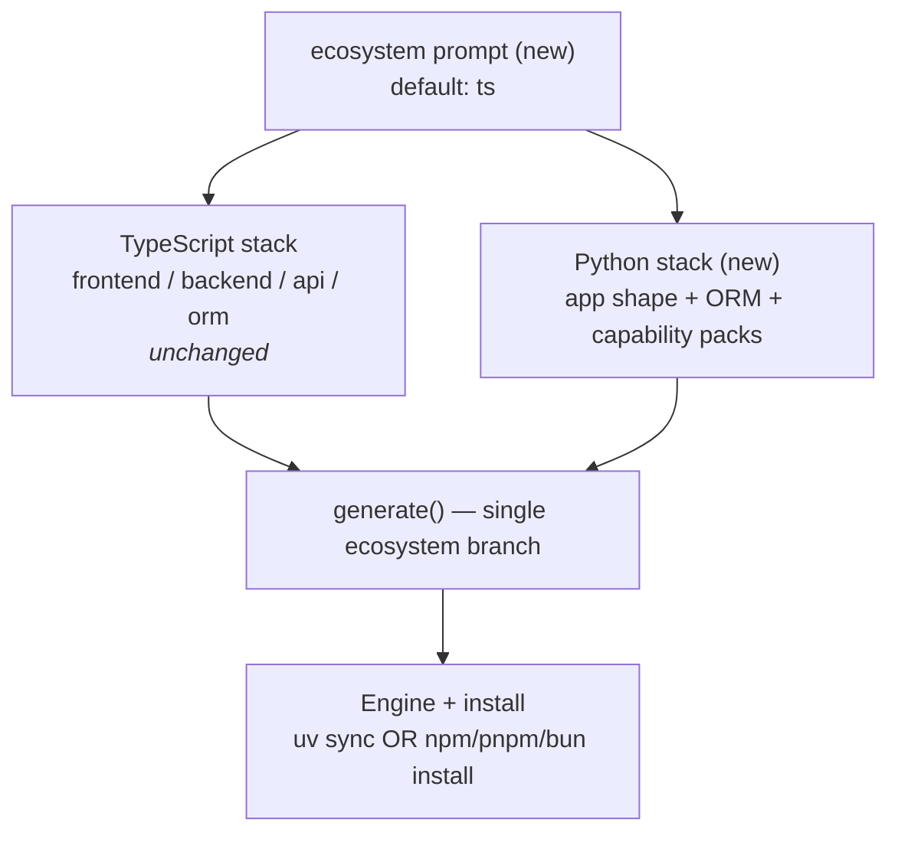
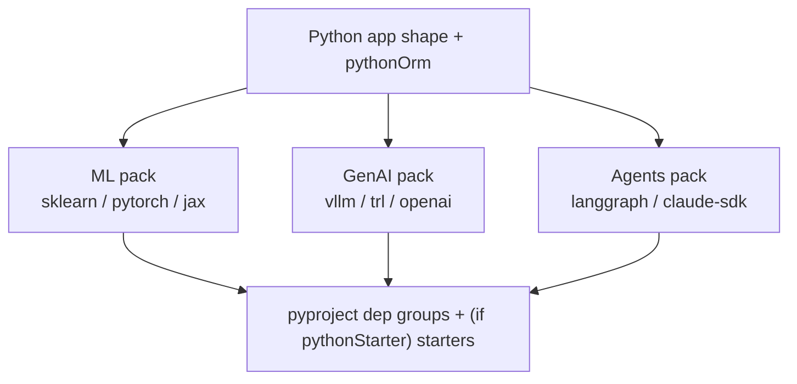

# Implementation Plan — Adding a Polyglot Python / uv / ML Ecosystem

> Companion to _Understanding `create-better-t-stack`_. This document specifies **how** to extend the fork so Python is a first-class ecosystem — with no frontend, Python-native frontends (Streamlit/Gradio), and ML / GenAI / Agent capabilities — **without regressing the existing TypeScript paths.**
>
> **Status:** hardened against the actual codebase (schemas, prompts, validation pipeline, generator, web builder, tests verified file-by-file) and against current upstream docs for the external tooling (uv, PyTorch, vLLM/Unsloth/TRL, Cloudflare). Every claim below holds against real files and live tool behaviour; line references are given where they matter. See the **Decision Log (§13)** for the design decisions that shaped this revision.

---

## 0. The governing principle

> **`ecosystem: "ts"` is the default and a complete no-op. Every Python branch is additive and gated behind `ecosystem === "python"`.**

No existing prompt, template, handler, processor, or test changes behaviour unless the discriminator flips. If at any point an existing TS combination would render differently, the change is wrong.

**Precedent — and where it actually lives.** The codebase already short-circuits whole sub-trees with sentinel early-returns, but those guards are **downstream** of an earlier answer, not at the root:

- `api.ts:14`, `auth.ts:29`, `orm.ts:32`, `database.ts:7`, `runtime.ts:7`, `server-deploy.ts:36`, `database-setup.ts:12` all early-return when `backend === "convex"`.
- The imperative validators mirror this: `validateConvexConstraints`, `validateBackendNoneConstraints`, `validateSelfBackendConstraints` (`utils/config-validation.ts`).

`ecosystem` is the **same shape of guard, one level higher** — but note it sits at the _root_ of the dependency chain (before `frontend`), which is new territory: `frontend` is currently the first prompt and has no upstream guard. So we are _generalizing_ an existing idiom, not reusing one verbatim.

**The seam.** Generation branches **once**, at the top of `generate()` in `template-generator/src/generator.ts` (see §7) — _not_ by sprinkling guards across 22 pipeline steps. This makes the TS path byte-identical by construction.

---

## 1. The discriminator: `ecosystem`

Add a single top-level axis as **the first prompt** in the dependency chain. It conceptually turns the flat config into a discriminated union:

```
{ ecosystem: "ts" }     & TsStack       // unchanged
{ ecosystem: "python" } & PythonStack   // new, additive
```



### Approach: flat config + parallel fields (low blast radius)

A _true_ `z.discriminatedUnion` is the clean ideal, but `ProjectConfig` is read in dozens of places, so a full union refactor is high-risk. Pragmatic path:

- Keep the flat config object.
- Add `ecosystem` plus **parallel** Python fields: `pythonApp`, `pythonOrm`, `pythonMl`, `pythonGenai`, `pythonAgents`, `accelerator`, `pythonStarter` — rather than overloading the existing `frontend`/`backend`/`orm` enums.
- Enforce union semantics **imperatively** in the validation pipeline (§2.2), not in Zod.

**Why parallel fields?** Every existing prompt filters on the TS enums (`FULLSTACK_FRONTENDS`, `f === "astro"`, `allowedApisForFrontends`, …) and the exhaustive matrix crosses `frontend × backend`. Injecting `"streamlit"`/`"sqlalchemy"` there pollutes all of it. Separate fields keep the TS matrix byte-for-byte identical and give Python its own small, independent matrix.

**Exception — `database` is _reused_, not duplicated** (Decision 6). The `database` enum (`none/sqlite/postgres/mysql/mongodb`) is plumbing-neutral — it is just an enum; the handlers that turn it into Drizzle/Prisma config are TS-only and are bypassed by the generator branch. Python reuses `database` and adds **one** parallel `pythonOrm` field. (`mongodb` is excluded from Python v1 — see §2.2.)

---

## 2. Schema changes (`packages/types/src/schemas.ts`)

### 2.1 New enums + fields

```ts
export const EcosystemSchema = z.enum(["ts", "python"]).default("ts");

// Python project "shape" — collapses frontend/backend the way `self` does for TS
export const PythonAppSchema = z.enum([
  "library", // pure package / CLI — no server, no UI
  "fastapi",
  "flask",
  "django", // API service, no UI
  "streamlit",
  "gradio",
  "fasthtml", // fullstack: UI *is* the server (≈ TS `self`)
  "fastapi+streamlit", // API + separate Python UI (two apps, uv workspace)
  "none",
]);

// Parallel Python ORM (the TS ORMSchema stays drizzle/prisma/mongoose/none, untouched)
export const PythonOrmSchema = z.enum(["none", "sqlalchemy", "sqlmodel", "tortoise"]);

export const AcceleratorSchema = z.enum(["cpu", "cu121", "cu124", "rocm"]).default("cpu");

// Capability packs — multi-select, modeled like addons/examples
export const PythonMlSchema = z.enum([
  "scikit-learn",
  "pytorch",
  "tensorflow",
  "jax",
  "xgboost",
  "lightgbm",
]);
export const PythonGenaiSchema = z.enum([
  // heavy: self-host / train (own the torch graph, imply a GPU — CUDA or ROCm)
  "transformers",
  "vllm",
  "unsloth",
  "trl",
  "peft",
  "accelerate",
  // light: hosted API clients
  "openai",
  "anthropic",
  "google-genai",
  "litellm",
]);
export const PythonAgentsSchema = z.enum([
  "langgraph",
  "openai-agents",
  "claude-agent-sdk",
  "pydantic-ai",
  "llamaindex",
  "crewai",
  "autogen",
]);

// The ONE place we use a Zod array-level superRefine — mirrors AddonsListSchema (schemas.ts:57)
export const PythonGenaiListSchema = z.array(PythonGenaiSchema).superRefine((picks, ctx) => {
  const heavy = picks.filter((x) => ["vllm", "unsloth", "trl"].includes(x));
  if (heavy.length > 1) {
    ctx.addIssue({
      code: z.ZodIssueCode.custom,
      message: `Pick one of vllm/unsloth/trl (got ${heavy.join(", ")})`,
    });
  }
});

// Opt-in capability starters (Decision 4) — replaces the non-existent examples "starter"
// (ExamplesSchema stays ["todo","ai","none"], untouched)
//   field: pythonStarter: z.boolean()  → added to ProjectConfigSchema / CreateInputSchema
```

**Only ONE existing enum changes (Decision 5):**

```ts
export const PackageManagerSchema = z.enum(["npm", "pnpm", "bun", "uv"]);
```

`RuntimeSchema` is **NOT** extended. Python sets `runtime: "none"` (the install branch keys off `ecosystem`, not `runtime` — §8), so adding `"uv"` to `RuntimeSchema` would be dead surface that pollutes every `runtime === ...` switch. Keep it `["bun","node","workers","none"]`.

Add the new fields to `ProjectConfigSchema`, `CreateInputSchema`, **and** `BetterTStackConfigSchema` (the `bts.jsonc` written into every project — Decision 3), plus the `*_VALUES` exports at the bottom of `schemas.ts`.

### 2.2 Cross-field rules live in the imperative validator — NOT a schema `superRefine` (Decision 2)

> **Critical correction.** This codebase does **no** meaningful cross-field validation in Zod. `ProjectConfigSchema` (`schemas.ts:470`) is a plain `z.object` with zero refinements; only `CreateInputSchema` carries a single trivial `.refine` and it's the schema actually `.parse`d at runtime (`index.ts:192`, `mcp.ts:39`). **All** real cross-field logic is imperative, in `utils/config-validation.ts → validateFullConfig()` and `validateConfigForProgrammaticUse()`, and is **flag-aware** (`providedFlags: Set<string>` — a rule fires only when the user _explicitly passed_ that flag, so prompt-resolved values aren't false-rejected). A Zod `superRefine` cannot see `providedFlags`, so it would reject legitimate configs.

Therefore:

**(a) New `validatePythonConstraints(config, providedFlags)`** in `config-validation.ts`, modeled on `validateConvexConstraints`, returning `Result<void, ValidationError>`, wired into **both** `validateFullConfig` (flag/CLI path) and `validateConfigForProgrammaticUse` (programmatic/MCP path). It enforces:

```
if (config.ecosystem !== "python") return ok;        // TS untouched
- api must be "none"
- pythonOrm ∈ {none, sqlalchemy, sqlmodel, tortoise}; orm (TS) must be "none"
- database ≠ "mongodb"  (SQL-only in v1; beanie/motor deferred)
- dbSetup must be "none" (managed providers are JS/edge-oriented; deferred to v2)
- packageManager must be "uv"
- heavy GenAI (vllm/unsloth/trl present) ⟹ accelerator ≠ "cpu"   (these target a GPU; their CPU paths are degraded/partial)
- heavy GenAI ⟹ serverDeploy ≠ "cloudflare"   (Workers' compute runtime gives deployed code no GPU — Cloudflare's own GPUs are exposed only via the managed Workers AI product, which you can't deploy a vLLM container to)
```

> **ROCm is allowed — there is no `accelerator ≠ "rocm"` rule.** vLLM treats ROCm as a first-class platform (pre-built ROCm wheels, validated on MI300/MI350), Unsloth has official AMD/ROCm support, and TRL runs wherever PyTorch runs. ROCm is permitted and labelled _experimental_ in the index map (§6.2) because its per-package build matrix is less battle-tested than CUDA. The only block among the heavy packs is the intra-stack version conflict (§6.3).

**(b) Short-circuit the TS none/convex/self cascades for Python.** Add `if (config.ecosystem === "python") return Result.ok(undefined);` at the top of `validateBackendNoneConstraints`, `validateConvexConstraints`, `validateSelfBackendConstraints`, and guard the database/orm/examples/payments checks inside `validateFullConfig`. **Reason:** Python sets `backend: "none"` but may carry `database: "postgres"`; `validateBackendNoneConstraints` (`config-validation.ts:300`) otherwise rejects _"Backend 'none' requires `--database none`"_. Python validation **replaces** the TS cascade, it doesn't stack on top of it.

**(c) The single Zod `superRefine`** is `PythonGenaiListSchema` (§2.1) — the intra-array heavy-stack conflict, mirroring `AddonsListSchema`'s nx/turborepo check (`schemas.ts:57`). This one _can_ be structural because it needs no other field.

**(d) Prompt-time filtering** (the second, separate layer the original plan conflated): the GenAI multi-select greys out the conflicting heavy picks live once one is chosen, mirroring `getCompatibleAddons` (`compatibility-rules.ts:341`).

### 2.3 Mirror everywhere the schema is consumed — the 13-surface checklist (Decision 7)

Every new field must thread through a fixed, discoverable set of surfaces. Missing one = silent desync (works interactively but not via `--yes`; or never round-trips into `bts.jsonc`). The canonical list is **§12**. Two callouts here:

- `DEFAULT_CONFIG` lives in **`apps/cli/src/constants.ts`**, _not_ `packages/types/src/constants.ts` (which holds only `desktopWebFrontends`). The original §12 pointed at the wrong file.
- `json-schema.ts` must be regenerated (feeds the web Stack Builder **and** the MCP server).

---

## 3. Prompt changes (`apps/cli/src/prompts`)

### 3.1 New prompt files

- `ecosystem.ts` — `getEcosystemChoice(flag)`, default `ts`.
- `python-app.ts` — `getPythonAppChoice(ecosystem, flag)`; early-returns `"none"` (no UI) if `ecosystem !== "python"`.
- `python-capabilities.ts` — `pythonOrm` select, three multi-selects (`ml`, `genai`, `agents`), the `accelerator` question (asked only when a **torch-based** pick is present — see below), and the `pythonStarter` boolean (asked only when ≥1 pack is selected). All early-return defaults (no UI) when `ecosystem !== "python"`.

> **Torch-based picks** (gate the accelerator question): `pytorch` (ML), and `transformers / vllm / unsloth / trl / peft / accelerate` (GenAI heavy). `tensorflow` and `jax` have their own GPU stories and do **not** trigger the accelerator prompt in v1.

### 3.2 Both config-construction paths must be wired (Decision 1)

`gatherConfig()` (`config-prompts.ts`) has **two** independent branches; the original plan only addressed one:

1. **`isSilent()` branch** (`config-prompts.ts:64`) — hand-builds the config object with **no prompts**. This is what `--yes`/flags/programmatic API/MCP and the **CI matrix** use. It must gain `ecosystem`, `pythonApp`, `pythonOrm`, `pythonMl`, `pythonGenai`, `pythonAgents`, `accelerator`, `pythonStarter` (each `flags.X ?? DEFAULT_CONFIG.X`).
2. **`navigableGroup({...})` branch** — register `ecosystem` **first**, thread `results.ecosystem` into downstream prompts, and add the Python prompts.

Also update, in the same file: the `PromptGroupResults` type (`:39`) and the final return-mapping object (`:160`). And add `--python-*` / `--ecosystem` flags to `CreateInputSchema` + the CLI command in `index.ts` + `McpCreateProjectInputSchema` in `mcp.ts`.

```ts
const result = await navigableGroup<PromptGroupResults>({
  ecosystem: () => getEcosystemChoice(flags.ecosystem),
  frontend: ({ results }) =>
    getFrontendChoice(flags.frontend, flags.backend, flags.auth, results.ecosystem),
  backend: ({ results }) =>
    getBackendFrameworkChoice(flags.backend, results.frontend, results.ecosystem),
  // ...existing TS prompts each gain a results.ecosystem argument and an early guard (§3.3)...
  pythonApp: ({ results }) => getPythonAppChoice(results.ecosystem, flags.pythonApp),
  pythonOrm: ({ results }) =>
    getPythonOrmChoice(results.ecosystem, results.database, flags.pythonOrm),
  pythonMl: ({ results }) => getPythonMlChoice(results.ecosystem, flags.pythonMl),
  pythonGenai: ({ results }) => getPythonGenaiChoice(results.ecosystem, flags.pythonGenai),
  pythonAgents: ({ results }) => getPythonAgentsChoice(results.ecosystem, flags.pythonAgents),
  accelerator: ({ results }) => getAcceleratorChoice(results),
  pythonStarter: ({ results }) => getPythonStarterChoice(results),
});
```

`navigableGroup` correctly skips no-UI prompts and steps over them during back-navigation (`navigable-group.ts:77`, `didLastPromptShowUI()`), so "return a value, show no UI" is the right idiom.

### 3.3 Gate the existing TS prompts via a single shared projection (Decision 5)

The original `if (ecosystem === "python") return "none"` is **type-wrong** for array fields (`getFrontendChoice` returns `Frontend[]`, `frontend.ts:19`) and silently incomplete (it lists 7 prompts; `gatherConfig` actually resolves ~20 fields — 16 in `PromptGroupResults` plus `projectName`/`projectDir`/`relativePath`/option metadata). Instead, define **one** shared constant reused by _both_ the silent path and the gated prompts so they can't drift:

```ts
// apps/cli/src/constants.ts
export const PYTHON_TS_FIELD_DEFAULTS = {
  frontend: [] as Frontend[], // array type — NOT "none"
  backend: "none",
  api: "none",
  orm: "none", // TS ORM stays none; Python uses pythonOrm
  auth: "none",
  payments: "none",
  runtime: "none", // NOT "uv"
  packageManager: "uv", // drives the install branch + reproducible cmd
  addons: [] as Addons[],
  examples: [] as Examples[],
  dbSetup: "none", // v1
  webDeploy: "none",
  serverDeploy: "none",
  // database, git, install: user/Python choices — not forced here
} as const;
```

Each gated TS prompt becomes `if (ecosystem === "python") return PYTHON_TS_FIELD_DEFAULTS.frontend;` (etc.). `database` is **not** in the projection — Python may carry a real database (§2.2 / Decision 6).

---

## 4. The Python project shapes

`pythonApp` resolves the directory layout and which templates fire:

| `pythonApp`                         | What it is                                        | Generated layout                                                              |
| ----------------------------------- | ------------------------------------------------- | ----------------------------------------------------------------------------- |
| `library`                           | Package / CLI, no server, no UI                   | Flat: `pyproject.toml`, `src/<pkg>/`, `tests/`                                |
| `fastapi` / `flask` / `django`      | API service, no UI                                | `apps/api/` (or flat if sole app)                                             |
| `streamlit` / `gradio` / `fasthtml` | **Fullstack in one process** (UI _is_ the server) | Single app — suppresses the separate-backend question, exactly like TS `self` |
| `fastapi+streamlit`                 | API + separate Python UI                          | Two apps (`apps/api`, `apps/app`) wired via a **uv workspace**                |

Streamlit/Gradio/FastHTML map onto the existing **`self` (fullstack)** concept — one runnable thing that is both UI and server.

**Workspace layout (Decision 8).** Mirror how the TS path emits `extras/pnpm-workspace.yaml.hbs` + a root `base/package.json.hbs`, but with uv:

- **Single-app shapes** (`library`, sole `fastapi`/`flask`/`django`, `streamlit`/`gradio`/`fasthtml`) → a **flat root `pyproject.toml`, no workspace**. Simplest possible; `uv sync` at root.
- **`fastapi+streamlit`** → a **root `pyproject.toml` declaring `[tool.uv.workspace] members = ["apps/*"]`**, plus a per-app `pyproject.toml` in `apps/api` and `apps/app`. A single `uv.lock` at the root. **Extras are declared at the root project** (aggregating member optional-deps) so `uv sync --extra …` works from the root in v1.

Use **uv workspaces**, **not** Turborepo/Nx (a JS monorepo runner around Python packages breaks at install time).

---

## 5. Capability packs: ML / GenAI / Agents

**Dependency packs + optional starters**, not app skeletons. Adding `pytorch` doesn't change whether you built an API or a Streamlit app; it adds dependencies and (if `pythonStarter`) a `train.py`. Modeled like the `addons`/`examples` multi-selects: additive, composable, gated by `ecosystem === "python"`.



**Heavy vs light split (inside GenAI)** — surfaced because it cascades into infra:

- _Heavy_ (`vllm`, `unsloth`, `trl`, `transformers`, `peft`) — own the torch dependency graph (pin specific torch/transformers versions) and run on a GPU, either CUDA **or** ROCm.
- _Light_ (`openai`, `anthropic`, `google-genai`, `litellm`) — pure HTTP clients, compose with anything.

**Starters (Decision 4).** Gated on the parallel boolean `config.pythonStarter` — **never** `examples.includes("starter")` (no such value exists). When `pythonStarter` is true, `python.ts` emits the starter per selected pack: `unsloth/trl → train.py`, `langgraph/agents → agent loop`, `vllm → serving entrypoint`.

---

## 6. The hard part: dependency resolution with `uv`

`uv` has first-class mechanisms for all three problems — **verify exact TOML keys against current uv docs, as uv evolves quickly.** The `(includes ...)` Handlebars helper used below already exists (`core/template-processor.ts:9`).

### 6.1 Each pick → a dependency group in `pyproject.toml.hbs`

```hbs
[project.optional-dependencies]
{{#if (includes pythonMl "pytorch")}}ml = ["torch>=2.4", "torchvision"]{{/if}}
{{#if (includes pythonGenai "vllm")}}serve = ["vllm>=0.6"]{{/if}}
{{#if (includes pythonGenai "unsloth")}}train = ["unsloth", "trl", "peft"]{{/if}}
{{#if (includes pythonAgents "langgraph")}}agents = ["langgraph", "langchain-core"]{{/if}}
{{#if (includes pythonGenai "anthropic")}}llm = ["anthropic"]{{/if}}
```

Install on demand: `uv sync --extra ml --extra agents`.

### 6.2 PyTorch ships per-accelerator wheels from its own index (Decision 9)

Driven by the `accelerator` prompt (only emitted for torch-based picks: `pytorch` + heavy GenAI `transformers/vllm/unsloth/trl/peft/accelerate`; `tensorflow`/`jax` excluded in v1). Index map:

| `accelerator` | Index URL                                  | Notes                                                                                               |
| ------------- | ------------------------------------------ | --------------------------------------------------------------------------------------------------- |
| `cpu`         | _(none — default PyPI)_                    | No explicit index emitted; plain `torch`                                                            |
| `cu121`       | `https://download.pytorch.org/whl/cu121`   | linux-marked source                                                                                 |
| `cu124`       | `https://download.pytorch.org/whl/cu124`   | linux-marked source                                                                                 |
| `rocm`        | `https://download.pytorch.org/whl/rocm6.x` | **linux-only** (PyTorch ROCm wheels are Linux-only); experimental but supported by vllm/unsloth/trl |

Emit the explicit index + source **only for `cu*`/`rocm`**, gated by `marker = "sys_platform == 'linux'"`, so macOS/Windows fall back to default (CPU/MPS) wheels:

> **v1 simplification — note.** PyTorch _does_ publish CUDA wheels for Windows, and uv's own canonical pattern gives Windows the CUDA index too (`marker = "sys_platform != 'linux'"` for the CPU fallback, leaving Windows+Linux on CUDA). This plan deliberately gates `cu*` to **Linux only** in v1 — Windows users get CPU/MPS wheels — to keep the marker matrix small. Widening to Windows-CUDA is a one-line marker change, deferred to v2.

```toml
[[tool.uv.index]]
name = "pytorch-cu124"
url  = "https://download.pytorch.org/whl/cu124"
explicit = true

[tool.uv.sources]
torch = [{ index = "pytorch-cu124", marker = "sys_platform == 'linux'" }]
```

This `[[tool.uv.index]]` + `explicit = true` + `[tool.uv.sources]` torch-with-`marker` shape is **verbatim** uv's own recommended PyTorch-on-uv pattern, so it's on the supported path. `accelerator: "rocm"` is a permitted choice here — vllm/unsloth/trl all run on ROCm (§2.2).

### 6.3 Mutually exclusive stacks → declare conflicts

`vllm` / `unsloth` / `trl` pin conflicting torch/transformers versions. Blocked at **three** layers: the array `superRefine` (§2.1), the imperative validator/prompt-filtering (§2.2), and the resolver:

```toml
[tool.uv]
conflicts = [[{ extra = "serve" }, { extra = "train" }]]
```

### 6.4 `requires-python` floor

Compute from the heaviest selected pack rather than hardcoding (vllm/unsloth constrain the interpreter version).

---

## 7. Generation: a single branch in `generator.ts` (Decision 3)

> **Critical correction.** `generate()` (`generator.ts:50`) runs **~22 steps**: 14 template-handlers (`:66-79`) **then 8 post-template steps** (`:81-88`) — `processPackageConfigs`, `processDependencies`, `processEnvVariables`, `processAuthPlugins`, `processAlchemyPlugins`, `processPwaPlugins`, `processCatalogs`, `processReadme`. **Every one assumes a JS/`package.json`/node_modules world** (merges `package.json`, writes a pnpm/bun catalog, emits an npm-flavored README). The original §7.1 only guarded the 14 handlers — the 8 processors would still run on a Python config and throw or emit garbage.

So we do **not** add per-step guards (22 chances to miss one). We branch **once**:

```ts
// generator.ts, immediately after `const vfs = new VirtualFileSystem();`
if (config.ecosystem === "python") {
  await processPythonTemplates(vfs, templates, config); // router by pythonApp (§7.1)
  processPyproject(vfs, config); // deps groups, extras, index, conflicts, requires-python
  processPythonDeploy(vfs, config); // Dockerfile (§7.3) — TS processDeployTemplates is bypassed
  processPythonReadme(vfs, config);
  if (options.version) {
    const reproducibleCommand = generateReproducibleCommand(config); // §12: python-aware
    writeBtsConfigToVfs(vfs, config, options.version, reproducibleCommand);
  }
  return buildTree(vfs, config); // same tree-assembly as TS path
}
// ── existing TS pipeline (lines 66-94) entirely unchanged ──
```

Consequences:

- The original §7.1 "add a no-op guard to each TS handler/processor" line is **deleted**. Zero edits to the 14 handlers and 8 processors → TS output provably byte-identical.
- `generateReproducibleCommand` (`reproducible-command.ts` — a hardcoded flag list, `:31-57`) must emit `--ecosystem python --python-app … --python-orm … --python-ml … --python-genai … --python-agents … --accelerator … [--python-starter]`. (Its `getBaseCommand` falls back to `npx create-better-t-stack@latest` for `uv`, which is correct — you don't install the CLI via uv.)
- `BetterTStackConfigSchema` (the persisted `bts.jsonc`) must carry the Python fields or the project can't reproduce itself.

### 7.1 New `processPythonTemplates` router

Routes by `pythonApp`, bypassing the TS `base`:

```ts
if (config.pythonApp === "library")
  processTemplatesFromPrefix(vfs, templates, "python/library", "", config);
if (["fastapi", "flask", "django"].includes(config.pythonApp))
  processTemplatesFromPrefix(vfs, templates, `python/${config.pythonApp}`, "apps/api", config);
if (["streamlit", "gradio", "fasthtml"].includes(config.pythonApp))
  processTemplatesFromPrefix(vfs, templates, `python/${config.pythonApp}`, ".", config);
if (config.pythonApp === "fastapi+streamlit") {
  processTemplatesFromPrefix(vfs, templates, "python/fastapi", "apps/api", config);
  processTemplatesFromPrefix(vfs, templates, "python/streamlit", "apps/app", config);
  // + uv workspace root pyproject
}
if (config.pythonStarter) appendPythonStarters(vfs, config); // Decision 4 — NOT examples
```

### 7.2 Templates (`templates/python/...`)

`pyproject.toml.hbs`, `app.py.hbs` / `main.py.hbs`, `_gitignore` (underscore-prefixed so it isn't treated as a live ignore file), `README.md.hbs`, ORM scaffolding per `pythonOrm`, and opt-in starter modules.

### 7.3 Python deploy / Docker (Decision 11)

`processDeployTemplates` (`template-handlers/deploy.ts`) is TS/frontend-keyed and is bypassed by the generator branch, so Python needs its own minimal deploy story:

- A `Dockerfile.hbs` emitted by `processPythonDeploy`: **`nvidia/cuda:*` base** when `accelerator` is `cu*` **and** heavy GenAI is present; otherwise **`python:3.x-slim`**, installing via uv (`uv sync`).
- `webDeploy` / `serverDeploy` stay `"none"` for Python v1 (already enforced by `PYTHON_TS_FIELD_DEFAULTS`). Managed-platform deploy (and the `packages/infra`/alchemy path) is **deferred to v2**. Heavy-GPU + Cloudflare is rejected by `validatePythonConstraints` regardless.
- Optional `docker-compose.yml.hbs` for a local DB when `database !== "none"`.

> **Codegen step — do not forget.** Templates are embedded via `bun run generate-templates` → `src/templates.generated.ts` (wired to `prebuild`; header says _"DO NOT EDIT"_). Adding `templates/python/**` requires **regenerating** this map, or the new `.hbs` files never ship.

---

## 8. Install / post-install branch (`apps/cli/src/helpers/core`)

```ts
// install-dependencies.ts — keys off ecosystem, not runtime/packageManager
if (config.ecosystem === "python") {
  const extras = collectExtras(config); // ["ml","agents",...]
  await run("uv", ["sync", ...extras.flatMap((e) => ["--extra", e])]);
} else {
  await run(config.packageManager, ["install"]); // unchanged
}
```

`post-installation.ts` — emit `uv run ...` next-steps for the Python path instead of `npm/pnpm/bun run`.

---

## 9. Keep the rest of the surface in sync

> **Correction (Decision 10).** The original draft said the web builder "reads the JSON Schema" and new fields "appear automatically." **False.** That is true _only_ for the MCP server. The web Stack Builder is **hand-built** and maintains its **own** option registry with a **different id vocabulary** than the CLI (e.g. `lib/constant.ts` uses `self-next`, `self-tanstack-start` — not `backend:self` + `frontend:next`).

- **MCP server** — `McpCreateProjectInputSchema` extends `CreateInputSchema` (`mcp.ts:39`); new fields _do_ appear automatically once `json-schema.ts` is regenerated and the `--python-*` flags are added. **Free.**
- **Web Stack Builder (`apps/web`)** — **manual work**, scoped to Phase 4:
  - `apps/web/src/lib/constant.ts` — add Python categories/options (with their own ids).
  - `apps/web/src/lib/stack-url-state.ts` — add a URL param per new field (`getValidIds(...)` pattern; one declaration each).
  - `apps/web/src/app/(home)/new/_components/stack-builder/{tech-categories.tsx,use-stack-builder.ts}` — UI + an **`ecosystem` mode switch** that swaps the whole category set (TS categories ⟷ Python categories), since the two stacks are largely disjoint.
  - `apps/web/test/stack-builder-compatibility.test.ts` — extend with Python rules.
- **Docs** — note the polyglot capability.

---

## 10. Testing plan

Mapped to the **real** test files in `apps/cli/test/` (verified to exist):

| Concern                        | Test file / tier                                            | Notes                                                                                                                                                                                                                                                      |
| ------------------------------ | ----------------------------------------------------------- | ---------------------------------------------------------------------------------------------------------------------------------------------------------------------------------------------------------------------------------------------------------- |
| TS paths unchanged             | `test/matrix/create-matrix.test.ts`                         | Run with default `ecosystem: "ts"` — byte-identical output (regression guard)                                                                                                                                                                              |
| Silent path carries new fields | `test/silent-create-output.test.ts`                         | `--yes`-style Python config round-trips (Decision 1)                                                                                                                                                                                                       |
| Schema/flags parse             | `test/input-schemas.test.ts`, `test/schema-command.test.ts` | New enums + `--python-*` flags accepted; `json-schema` regenerated                                                                                                                                                                                         |
| Python core shapes             | **New** small Python matrix                                 | `library / fastapi / streamlit / gradio / fastapi+streamlit` × (db on/off) — **separate** from the TS matrix                                                                                                                                               |
| Capability packs               | New, **representative** combos                              | `pytorch`, `vllm` serve, `unsloth` train, `langgraph+anthropic` — **not** crossed exhaustively                                                                                                                                                             |
| Conflict + infra rules         | `test/cli-validation.test.ts`                               | `vllm+unsloth` → reject; Python + non-`none` api → reject; heavy GenAI + Cloudflare → reject; Python + mongodb → reject                                                                                                                                    |
| Accelerator wiring             | Unit / template snapshot                                    | `cpu` vs `cu124` → correct `[tool.uv.index]` / `[tool.uv.sources]`                                                                                                                                                                                         |
| Web parity                     | `apps/web/test/stack-builder-compatibility.test.ts`         | Stack Builder matches CLI                                                                                                                                                                                                                                  |
| **Field-plumbing guard (new)** | **New reflective test**                                     | Iterates `ProjectConfigSchema.shape` keys and asserts each appears in `DEFAULT_CONFIG`, the `isSilent()` return, `generateReproducibleCommand` output, and `BetterTStackConfigSchema` — converts §12 from human diligence into a failing test (Decision 7) |

Run `bun run check` (oxfmt + oxlint) and the CLI suite before committing; Conventional Commits (`feat(cli): add python ecosystem`).

---

## 11. Phased delivery (build order)

1. **Phase 0 — Discriminator skeleton + guardrails.** Add `ecosystem` (default `ts`) and the new fields to the schema; wire **both** the silent path and `navigableGroup` as pure no-ops; add the **single `generator.ts` branch** (Python side a stub); land the **reflective field-plumbing test**; prove `create-matrix` + `silent-create-output` are unchanged. _(De-risks everything.)_
2. **Phase 1 — Minimal Python app.** `library` + `fastapi`, `packageManager: "uv"`, `validatePythonConstraints` + cascade short-circuits, install branch, `pyproject.toml.hbs`, `generate-templates` regen. End-to-end generate + `uv sync`.
3. **Phase 2 — Python frontends & data.** `streamlit` / `gradio` / `fasthtml` (`self`-style) + `fastapi+streamlit` uv workspace; `pythonOrm` + `database` reuse (SQL only).
4. **Phase 3 — Capability packs.** ML, then GenAI (light clients → heavy + accelerator + conflicts), then Agents; `pythonStarter` opt-in starters.
5. **Phase 4 — Surface sync + polish.** `Dockerfile`/`processPythonDeploy`; MCP (free once flags + `json-schema` land); **manual** web Stack Builder work (categories, URL params, `ecosystem` mode switch — Decision 10); docs.

Each phase is independently shippable and leaves the TS experience untouched.

---

## 12. File-touch checklist — the 13 canonical surfaces (Decision 7)

Every new field (`ecosystem`, `pythonApp`, `pythonOrm`, `pythonMl`, `pythonGenai`, `pythonAgents`, `accelerator`, `pythonStarter`) must round-trip through all of these. The reflective test in §10 enforces it.

| #   | File / area                                                                                                      | Change                                                                                                                                                                                                                |
| --- | ---------------------------------------------------------------------------------------------------------------- | --------------------------------------------------------------------------------------------------------------------------------------------------------------------------------------------------------------------- |
| 1   | `packages/types/src/schemas.ts`                                                                                  | New enums + fields on `ProjectConfigSchema` / `CreateInputSchema` / **`BetterTStackConfigSchema`**; `PythonGenaiListSchema` array-`superRefine` (the only one); `*_VALUES` exports. **No cross-field `superRefine`.** |
| 2   | **`apps/cli/src/constants.ts`**                                                                                  | `DEFAULT_CONFIG` entries + `PYTHON_TS_FIELD_DEFAULTS` + option metadata _(corrected location — NOT `packages/types`)_                                                                                                 |
| 3   | `apps/cli/src/types.ts`                                                                                          | `ProjectConfig` / `CLIInput` TS types                                                                                                                                                                                 |
| 4   | `apps/cli/src/prompts/config-prompts.ts`                                                                         | `PromptGroupResults` type + **`isSilent()` branch** + `navigableGroup` registration + final return-mapping (4 spots)                                                                                                  |
| 5   | `apps/cli/src/index.ts`                                                                                          | `--ecosystem` / `--python-*` CLI flags                                                                                                                                                                                |
| 6   | `apps/cli/src/mcp.ts`                                                                                            | `McpCreateProjectInputSchema` extension                                                                                                                                                                               |
| 7   | `apps/cli/src/utils/config-validation.ts`                                                                        | `validatePythonConstraints` + short-circuit the none/convex/self cascades                                                                                                                                             |
| 8   | `packages/template-generator/src/utils/reproducible-command.ts`                                                  | Emit `--ecosystem` / `--python-*` flags                                                                                                                                                                               |
| 9   | `packages/template-generator/src/bts-config.ts`                                                                  | Persist new fields into `bts.jsonc`                                                                                                                                                                                   |
| 10  | `packages/types/src/json-schema.ts`                                                                              | Regenerate (feeds web + MCP)                                                                                                                                                                                          |
| 11  | `packages/template-generator/src/generator.ts`                                                                   | **Single** top-level `ecosystem === "python"` branch (+ `processPythonTemplates`, `processPyproject`, `processPythonDeploy`, `processPythonReadme`)                                                                   |
| 12  | `apps/web/src/lib/{constant.ts,stack-url-state.ts}` + `stack-builder/{tech-categories.tsx,use-stack-builder.ts}` | **Manual** (Decision 10): Python categories/options (own ids), per-field URL params, `ecosystem` mode-switch UI — **not** auto-generated                                                                              |
| 13  | Tests                                                                                                            | New Python matrix, representative pack combos, `cli-validation` rules, **reflective field-plumbing test**, regression guards                                                                                          |
| +   | `apps/cli/src/prompts/{ecosystem,python-app,python-capabilities}.ts`                                             | **New** prompt files                                                                                                                                                                                                  |
| +   | `apps/cli/src/prompts/{frontend,backend,api,orm,runtime,auth,payments,…}.ts`                                     | One-line `PYTHON_TS_FIELD_DEFAULTS` guard (correct types)                                                                                                                                                             |
| +   | `packages/template-generator/templates/python/**`                                                                | **New** `.hbs` templates + `Dockerfile.hbs` (Decision 11) + starters                                                                                                                                                  |
| +   | `packages/template-generator`                                                                                    | **Run `bun run generate-templates`** to embed new templates                                                                                                                                                           |

---

## 13. Decision Log

Resolved during the grilling pass; each corrects or sharpens the original draft.

1. **Silent path is in scope for every phase.** `gatherConfig` has two branches (`isSilent()` + `navigableGroup`); both must carry the new fields, plus `PromptGroupResults`, the return-mapping, and `CreateInputSchema`. The Phase-0 regression matrix runs _through_ the silent path.
2. **Cross-field validation is imperative, not Zod.** Add a flag-aware `validatePythonConstraints` to `validateFullConfig` _and_ `validateConfigForProgrammaticUse`; reserve `superRefine` only for the single-array heavy-GenAI conflict; grey out conflicts at prompt time.
3. **One generator seam, not per-step guards.** Branch once at the top of `generate()`; leave all 14 handlers + 8 processors untouched. `BetterTStackConfigSchema` + `generateReproducibleCommand` are in scope.
4. **`pythonStarter` boolean replaces the non-existent `examples "starter"`.** `ExamplesSchema` stays `todo/ai/none`. Also: regenerate the embedded-templates map.
5. **Shared `PYTHON_TS_FIELD_DEFAULTS` projection.** `frontend → []`, `packageManager → "uv"`, `runtime → "none"` ⟹ only `PackageManagerSchema` is extended (not `RuntimeSchema`).
6. **Reuse `database` + add parallel `pythonOrm`.** `validatePythonConstraints` short-circuits the TS none/convex/self cascades; `dbSetup` forced `none` and `mongodb` excluded in v1.
7. **13-surface plumbing checklist + a reflective CI test** that mechanically asserts every schema field is wired everywhere (corrects the `DEFAULT_CONFIG` location).
8. **uv workspace layout.** Single-app shapes → flat root `pyproject.toml`; `fastapi+streamlit` → root `[tool.uv.workspace] members = ["apps/*"]` + per-app `pyproject.toml`, single root `uv.lock`, extras at root.
9. **Accelerator index map + linux markers.** `cpu` = default PyPI (no explicit index); `cu121/cu124/rocm` = explicit index gated by `sys_platform == 'linux'` (a v1 simplification — CUDA-on-Windows wheels exist and widening to them is a one-line marker change deferred to v2); the index/source/marker shape is verbatim uv's recommended PyTorch pattern. `rocm` is allowed and labelled experimental — vllm/unsloth/trl all support ROCm. The only block among the heavy packs is the version-conflict `superRefine`/`[tool.uv] conflicts` (§6.3).
10. **The web Stack Builder is hand-built, not schema-driven.** Only MCP auto-syncs from `json-schema.ts`. The web builder needs manual categories/URL-params/UI + an `ecosystem` mode switch; it uses its own id vocabulary (`self-next`, …).
11. **Python deploy is Docker-only in v1.** `processPythonDeploy` emits a uv-based `Dockerfile.hbs` (CUDA base for `cu*` + heavy GenAI, else slim); `webDeploy`/`serverDeploy` stay `none`; managed-platform deploy deferred to v2.
