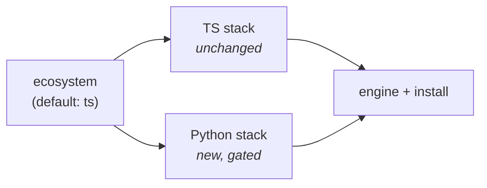

# Tech Lead Summary — Polyglot Python Ecosystem for `create-better-t-stack` (Fork)

**Audience:** Engineering lead / reviewer · **Goal:** decide on approach, scope, and sequencing.
**Companion docs:** `01-understanding-*` (how the tool works) · `02-implementation-*` (full spec).

---

## TL;DR

We are forking `create-better-t-stack` (a schema-driven project scaffolder, currently TypeScript-only) to make **Python a first-class ecosystem**: projects with no frontend, with Python-native UIs (Streamlit/Gradio), and with **ML / GenAI / Agent** capabilities (PyTorch, scikit-learn, vLLM, TRL, Unsloth, OpenAI/Anthropic clients, LangGraph, etc.), managed by **uv**.

The design adds **one top-level `ecosystem` discriminator** that defaults to `ts` and gates all new behaviour. **The existing TypeScript experience is provably unchanged** — every Python path is additive and switched off by default. Estimated **4 incremental phases**, each independently shippable.

---

## Why this is low-risk (the one idea that matters)

The tool is already schema-driven: a choice is a validated enum → a prompt → a template-folder mapping → a rendered file tree. We exploit two facts already true in the codebase:

1. **Prompts short-circuit on earlier answers** (e.g. selecting the `convex` backend auto-skips the runtime question). We add an `ecosystem` answer at the very top and let every TS prompt early-return for Python — _one line each, no rewrites._
2. **The generation engine is language-agnostic** — it copies files and runs templates; it doesn't care if the output is Python.

So we are not refactoring the engine. We are adding a parallel, gated branch. **Default = `ts` = byte-for-byte identical output**, enforced by re-running the existing exhaustive test matrix as a regression guard.

---

## What's in scope

| Capability            | Detail                                                                                                  |
| --------------------- | ------------------------------------------------------------------------------------------------------- |
| Python project shapes | Library/CLI · API (FastAPI/Flask/Django) · Fullstack UI (Streamlit/Gradio/FastHTML) · API + separate UI |
| Package management    | **uv** (workspaces for multi-app), replacing npm/pnpm/bun on the Python path                            |
| ML pack               | scikit-learn, PyTorch, TensorFlow, JAX, XGBoost, LightGBM                                               |
| GenAI pack            | vLLM, Unsloth, TRL, Transformers, PEFT (heavy/GPU) + OpenAI, Anthropic, LiteLLM (hosted clients)        |
| Agents pack           | LangGraph, OpenAI Agents SDK, Claude Agent SDK, Pydantic-AI, LlamaIndex, CrewAI                         |
| Surfaces kept in sync | CLI, web Stack Builder, MCP server                                                                      |

**Explicitly out of scope:** cross-language type safety (Python can't join the tRPC/oRPC type graph — by design, Python projects set `api = none`).

---

## Key technical decisions (for review)

1. **Discriminator over union refactor.** Add `ecosystem` + _parallel_ Python fields rather than a full `z.discriminatedUnion` rewrite or overloading the existing `frontend`/`backend` enums. Keeps the TS matrix untouched; lowest blast radius. _(Trade-off: a few `if (python) return` guards vs a large type refactor — we chose the guards.)_
2. **Capability packs are Addons, not Core Stack.** ML/GenAI/Agents are dependency packs + optional starters, modeled like the existing multi-select `addons`/`examples`. **This keeps them out of the exhaustive combinatorial matrix** — they're tested by representative combinations instead.
3. **uv owns dependency resolution.** The genuinely hard ML problems — PyTorch CPU/CUDA wheels, mutually-incompatible stacks (vLLM vs Unsloth vs TRL), Python-version floors — are handled by uv's index/sources/conflicts mechanisms, generated into `pyproject.toml`. We also block known-bad combos in schema validation so the CLI never offers a dead end.
4. **Infra coupling is encoded in validation.** Heavy GenAI (GPU) forces a CUDA Docker base image and forbids serverless deploy targets (e.g. Cloudflare Workers) at the schema level.

---

## Risks & mitigations

| Risk                                         | Likelihood            | Mitigation                                                                                                                                                                |
| -------------------------------------------- | --------------------- | ------------------------------------------------------------------------------------------------------------------------------------------------------------------------- |
| Regressing the TS experience                 | Low                   | `ecosystem` defaults to `ts`; re-run existing Full Matrix as a regression gate (Phase 0).                                                                                 |
| Combinatorial test explosion                 | Medium                | Packs are Addon-class; representative combos + rule tests, **not** exhaustive crossing.                                                                                   |
| uv dependency conflicts (torch/vLLM/Unsloth) | High (domain reality) | Declare `[tool.uv] conflicts`; block in `superRefine`; accelerator prompt drives the torch index. Verify TOML keys vs current uv docs.                                    |
| Surface drift (web/MCP vs CLI)               | Medium                | Single schema source (`json-schema.ts`); regenerate + include web Stack Builder in Phase 4.                                                                               |
| Upstream divergence / maintenance            | Medium                | Consider contributing the Python path upstream as an opt-in ecosystem rather than a hard fork — large shared surface (tests, web, MCP) is costly to maintain divergently. |

---

## Delivery plan

Each phase ships independently and leaves the TypeScript experience untouched.

| Phase                          | Deliverable                                                                                      | Rough effort\* |
| ------------------------------ | ------------------------------------------------------------------------------------------------ | -------------- |
| **0 — Discriminator skeleton** | `ecosystem` field threaded through as a no-op; TS Full Matrix proven unchanged                   | S              |
| **1 — Minimal Python app**     | `library` + `fastapi` shapes; uv install branch; `pyproject.toml` template; end-to-end `uv sync` | M              |
| **2 — Python frontends**       | Streamlit/Gradio/FastHTML (fullstack shape) + FastAPI+UI workspace                               | M              |
| **3 — Capability packs**       | ML → GenAI (light → heavy + accelerator + conflicts) → Agents; opt-in starters                   | L              |
| **4 — Surface sync & polish**  | Web Stack Builder, MCP, Dockerfiles, deploy gating, docs                                         | M              |

\* S/M/L = relative sizing for planning, not estimates. Phases 0–1 are the proof-of-concept gate; recommend a review checkpoint after Phase 1.

---

## Concrete task breakdown

**Schema (`packages/types`)**

- [ ] Add `EcosystemSchema`, `PythonAppSchema`, `AcceleratorSchema`, `PythonMl/Genai/Agents` enums; add `uv` to runtime + package-manager enums.
- [ ] `superRefine`: Python ⇒ `api=none` + Python ORM; block conflicting heavy GenAI; GPU ⇒ no serverless deploy; uv-only.
- [ ] Update `constants.ts` defaults/metadata; regenerate `json-schema.ts`.

**CLI prompts (`apps/cli/src/prompts`)**

- [ ] New `ecosystem.ts`, `python-app.ts`, `python-capabilities.ts`.
- [ ] Register `ecosystem` first in `config-prompts.ts`; thread into all prompts.
- [ ] One-line Python guard in `frontend/backend/api/orm/runtime/auth/payments`.

**Generator (`packages/template-generator`)**

- [ ] New `python.ts` template handler (routes by app shape, bypasses TS base).
- [ ] No-op guard in existing TS handlers.
- [ ] `templates/python/**`: `pyproject.toml.hbs` (uv index/sources/conflicts), app entrypoints, Dockerfiles, opt-in starters.

**Install (`apps/cli/src/helpers/core`)**

- [ ] `uv sync --extra ...` branch in `install-dependencies.ts`.
- [ ] `uv run` next-steps in `post-installation.ts`.

**Surfaces & tests**

- [ ] Web Stack Builder: ecosystem toggle + Python groups.
- [ ] Python-only test matrix (separate from TS exhaustive matrix).
- [ ] Addon Compatibility Coverage for packs; Compatibility Oracle rules for conflicts/infra.
- [ ] Regression: TS Full Matrix unchanged. `bun run check` + CLI suite green. Conventional Commits.

---

## Recommendation

Proceed through **Phase 0 → 1** as a proof of concept and **review before Phase 2**. Phase 0 is deliberately cheap and de-risks the entire effort by proving the TypeScript paths are untouched. In parallel, open a discussion with upstream: given how much surface (tests, web, MCP) a divergent core would have to keep in sync, landing this as an opt-in ecosystem upstream may be cheaper long-term than maintaining a hard fork.
